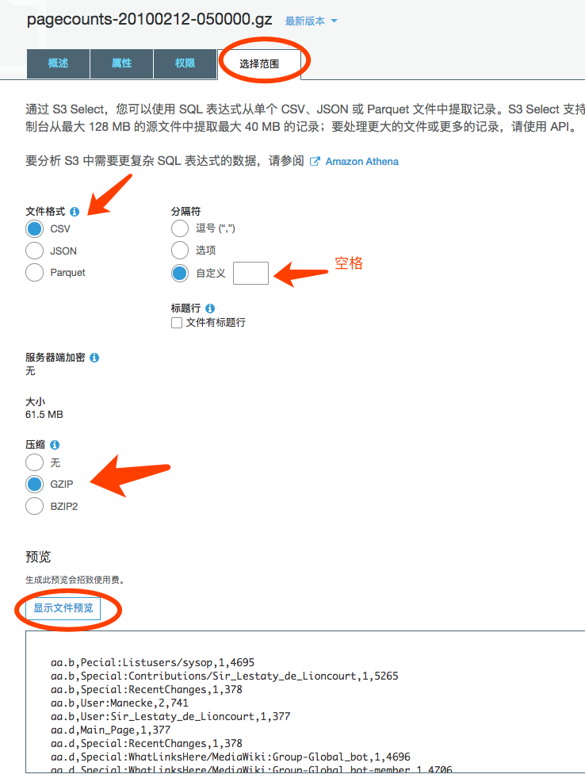
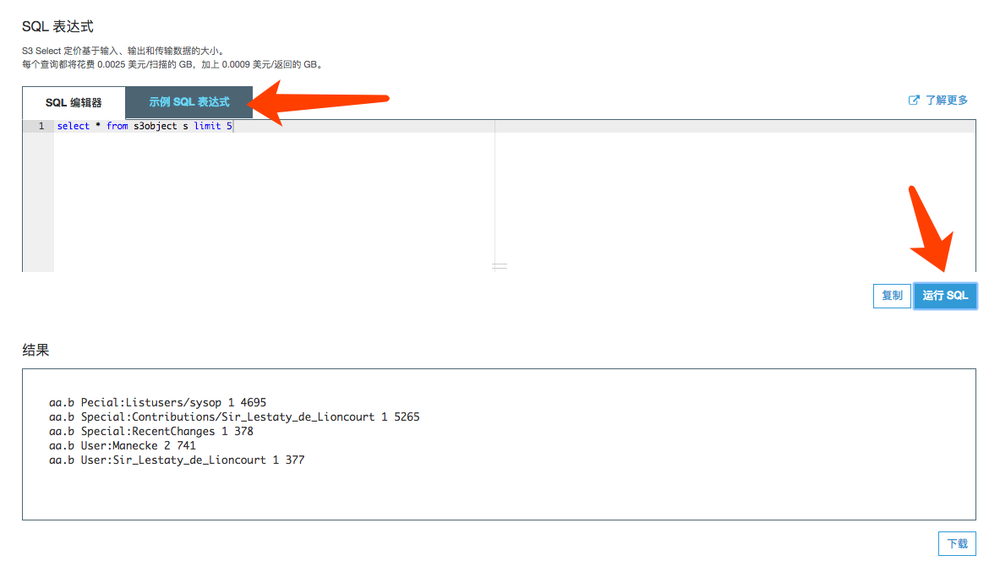
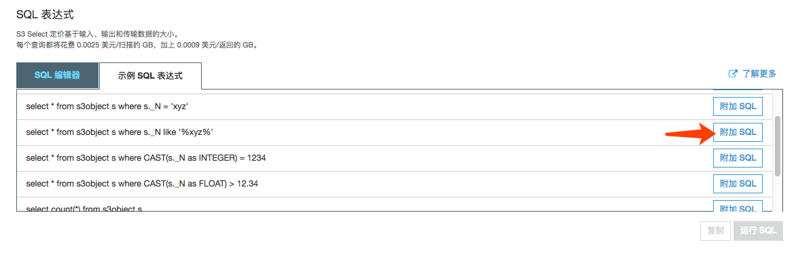

# 动手实验 Lab 1 - S3 Select

对于存放在 S3 上的数据，进行轻量级的数据提取，可以采用 S3 Select来实现。S3 Select 专用于从对象中仅提取所需数据，从而显著提高性能，并降低需要访问 S3 中的数据的应用程序成本。

大多数应用程序都必须检索整个对象，然后仅筛选出所需数据以进行进一步分析。借助 S3 Select，应用程序可以将筛选和访问对象内数据的繁重工作交给 Amazon S3 服务。通过减少必须由应用程序加载和处理的数据量，S3 Select 可以将经常访问 S3 数据的大多数应用程序的性能最多提高 400%。

## 前置准备
1. 本机安装 Python3

2. 本机安装 boto3，参考命令

    pip3 install boto3 --user

3. 本地进行 AWS Credentials 配置

    aws configure

配置可以访问 AWS 的 access key，如果之前使用过命令行则重用CLI的配置即可。

4. 下载以下2个样例数据文件，并上传到你账户的 S3 某个 Bucket 中

    [pagecounts-20100212-050000.gz](./sample-data/pagecounts-20100212-050000.gz)

    [users-data.json](./sample-data/users-data.json)

## 在控制台进行 S3 Select

1. 打开 S3 控制台，选择刚才上传的 pagecounts-20100212-050000.gz ，点选“选择范围”页面

2. Console 分析 CSV 样例数据
对 pagecount 数据样例进行 S3 Select 尝试：

注意选择文件格式，特别是分隔符是一个空格

尝试命令：  
    select count(*) from s3object s

    select * from  s3object s limit 10

    select s._1, s._4 from s3object s where s._4 = '377' limit 10

参考示例，自由做更多 S3 命令尝试

尝试其他更多的命令，参考：S3 SELECT command SQL
https://docs.aws.amazon.com/AmazonS3/latest/dev/s3-glacier-select-sql-reference-select.html

3. Console 分析 JSON 样例数据
对 users-data.json 进行 S3 Select
尝试命令：

    select s.userid, s.username, s.phone from s3object as s where s.userid = 7

## 使用 Python 程序调用 S3 Select

下载代码 [S3SelectDemo-csv.py](./S3SelectDemo-csv.py) 

替换代码中的 bucket 和 s3 bucket prefix 为上传的 users-data.json 文件所在位置 

在本地运行  

    python3 S3SelectDemo-csv.py

## 分析并尝试

* 获取S3 Select 还有哪些选项，S3 SELECT boto3 详细说明见:  
https://boto3.amazonaws.com/v1/documentation/api/latest/reference/services/s3.html#S3.Client.select_object_content

* 观察 Python 代码如何获取 Select 结果的  
Select返回的响应Payload是 botocore.eventstream.EventStream Object 详细说明见:
https://botocore.amazonaws.com/v1/documentation/api/latest/reference/eventstream.html#botocore-eventstream

* 动手  
使用S3 Select 分析 CloudTrail Logs Json，例如：  
        select * from s3object[*].Records[*] as s where s.eventName = 'AssumeRole';  
参考文档
https://docs.aws.amazon.com/AmazonS3/latest/dev/s3-glacier-select-sql-reference-select.html