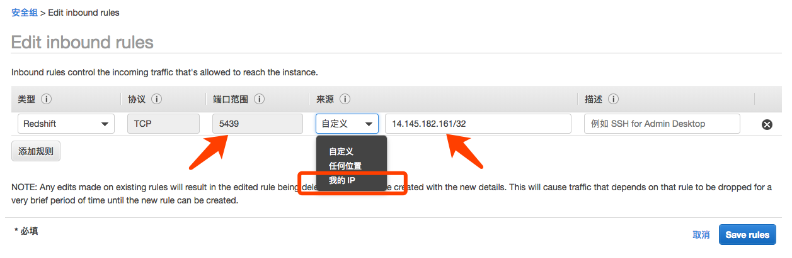
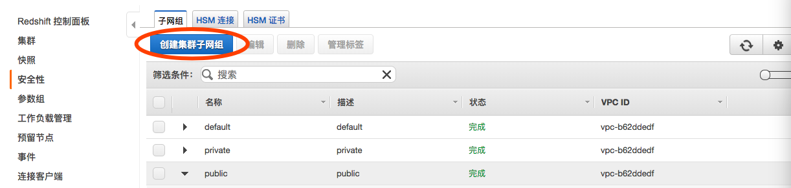
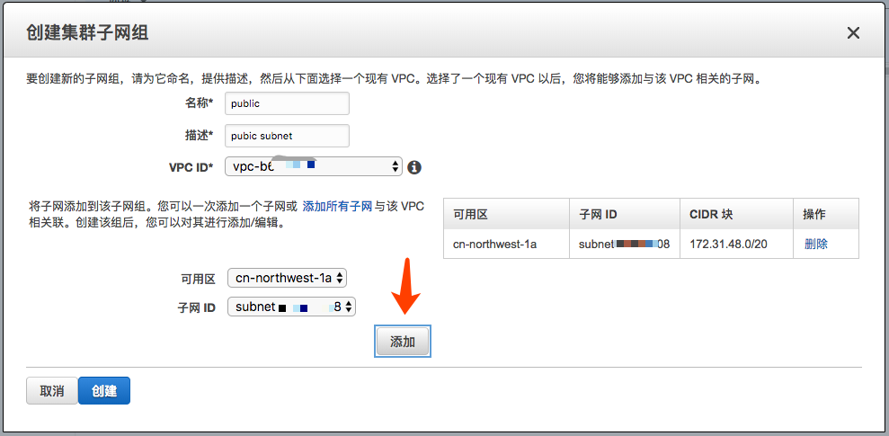
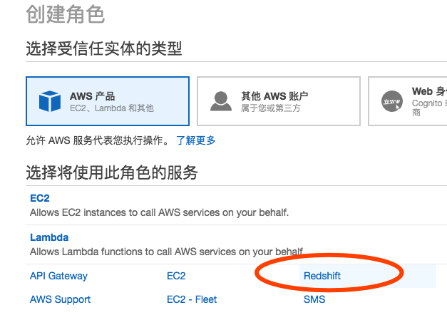
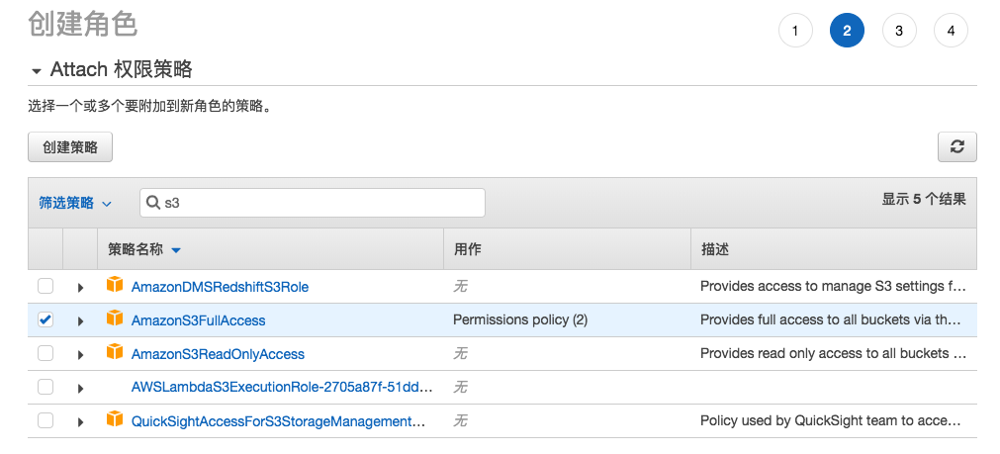
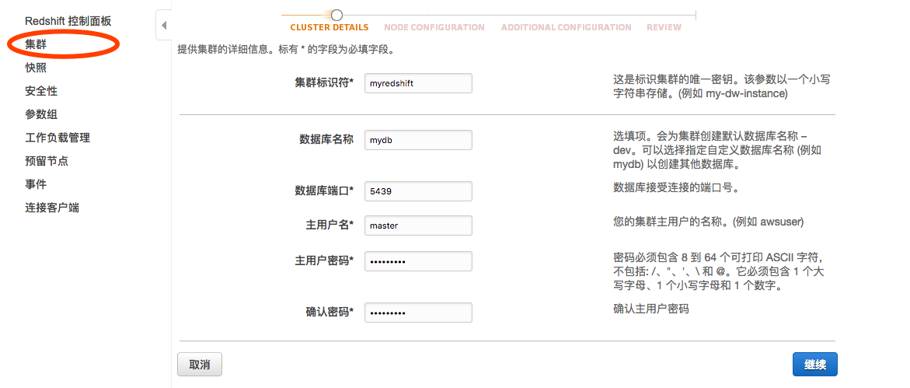
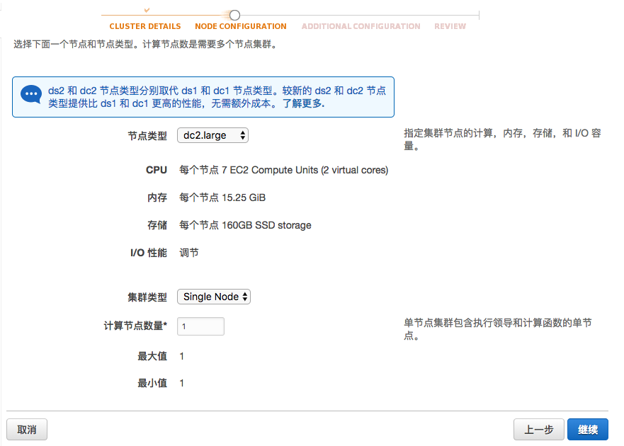
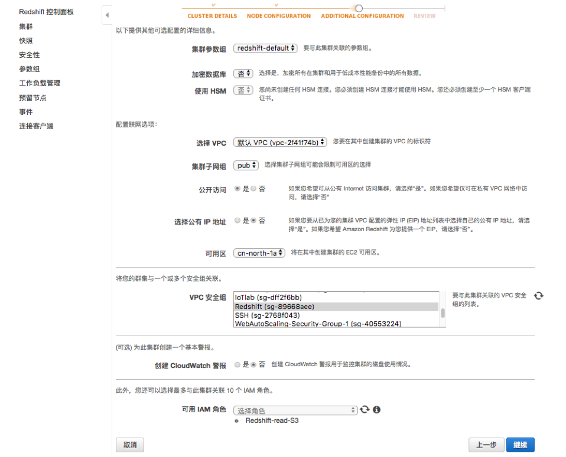
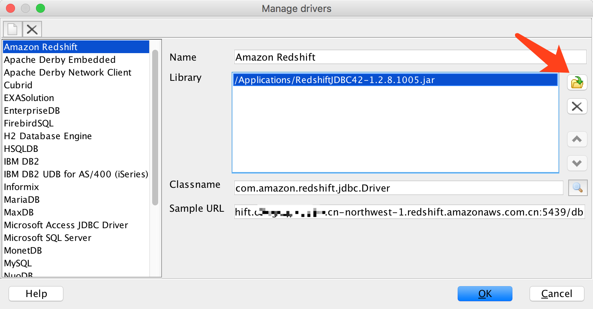
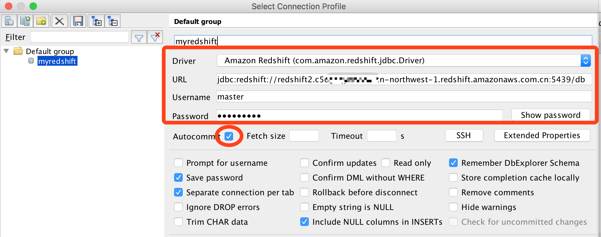

# 动手实验 4 - 数据仓库 Redshift 入门

Amazon Redshift 是一种完全托管的 PB 级高性能数据仓库服务，是业界性能最佳的数据仓库之一。
* PB级数据仓库
* 大规模并行处理(MPP)，基于列式存储的OLAP数据库引擎
* 关系型数据仓库(SQL) 管理简便、大幅扩容，基于PostgreSQL 8.0.2，可以连接不同类型客户端（JDBC/ODBC）
* 扩展性: 增大数据库的处理能力和存储容量，使用本地硬盘来提高IO性能，支持SSD存储介质
* 高效的表数据聚合和关联

## 前置准备

安装 数据仓库客户端  

安装以下其中一个客户端，或其他可以访问 PostgreSQL 的工具，例如：navicat
  
* 安装 SQL Workbench  (C/S)

https://docs.aws.amazon.com/zh_cn/redshift/latest/mgmt/connecting-using-workbench.html 

** 下载 JDBC 驱动程序

* 或安装 pgweb  (B/S)

https://docs.aws.amazon.com/zh_cn/redshift/latest/mgmt/connecting-from-psql.html

## 安全提醒

注意：强烈建议不要把集群直接暴露在公网并开放被所有 IP 访问，选择以下其中一种方式：  
1. 集群配置在私有子网，从公网访问位于公有子网的堡垒机去访问  
2. 集群配置在公有子网，其安全组只允许办公网的 IP 地址段访问
3. 集群配置在私有子网，通过专线或 VPN 连接访问

以下实验指导是按 2 来进行

建议配置 S3 终端节点，从 VPC 内部直接访问 S3 ，无需绕道公网速度更快  

## 建 Redshift 集群

* 配置安全组
打开 VPC 界面，创新一个新的安全组，命名例如： Redshift-demo。  
该安全组允许访问 5439 端口，来源地址是你的本地终端公网 IP 或 IP 地址段（如果你公司的公网出口是一个地址段），这样就限制了只允许你自己访问集群了
  
  
请在 VPC 界面中记录要部署 Redshift 集群的 VPC ID 和私有子网 Subnet ID 下一步骤使用  

* 配置 Redshift 的子网组
子网组是集群要部署的子网，在 Redshift 控制台点击 创建集群子网组  
  

选择 VPC 、可用区和一个私有子网 ID，并添加。
  

* 配置集群角色
该角色是赋予 Redshift 集群访问其他 AWS 资源的权限，本实验赋予其访问 S3 的权限，以便加载数据。  
在 IAM 界面，创建角色，选择受信任实体是 Redshift  
  

搜索并勾选 AmazonS3FullAccess 策略，并完成角色创建。
  

如果不希望赋予全部 S3 访问权限可以自己 创建策略：
点创建策略，点 JSON ，粘贴策略如下，请替换 bucket ：

    {
        "Version": "2012-10-17",
        "Statement": [
            {
                "Effect": "Allow",
                "Action": "s3:*",
                "Resource": [
                    "arn:aws-cn:s3:::bucket/*",
                    "arn:aws-cn:s3:::bucket"
                ]
            }
        ]
    }

提醒：以上仅为示例，请在生产环境中坚持最小权限原则，只配置其要访问的 Bucket/Object 权限和只允许有限的 Action  

拷贝这个新建角色的 ARN，等会要用到  

* 创建 Redshift 集群
创建  
    
  
选择节点类型，根据数据类型和运算方式选择密集存储还是密集计算节点  
  
 

选择 VPC，配置刚才创建的子网组、安全组和角色，完成创建集群

  

## 连接 Redshift 并操作

* 连接
从 Redshift 控制面板复制集群的“终端节点”，例如：  
    redshift2.c5ogcqxxxxxxx.cn-northwest-1.redshift.amazonaws.com.cn:5439  
  
以 SQL Workbench 为例，打开客户端  
  
配置 Manage Driver 选择下载的 RedshiftJDBC42.jar  
  
  
设置 Connect：  
Driver 选择 Amazon Redshift  
URL 粘贴刚才复制的终端节点到中间，形成：  
    jdbc:redshift://redshift2.c5ogcqxxxxxxx.cn-northwest-1.redshift.amazonaws.com.cn:5439/db  
勾选 Autocommit  
  
  
进行连接  
  
* 建表  

输入以下建表 SQL 并点击执行  

    create table wikistat 
    (
    projectcode varchar(128), 
    pagename varchar(1024), 
    pageviews bigint, 
    pagesize bigint
    )
    ;

* 从 S3 加载数据  

输入以下 SQL 并执行  
注意替换 S3 bucket/prefix 为样例数据文件的位置  
IAM_ROLE 是刚才新建的那个 Redshift 读取 S3 的角色 ARN  

    COPY wikistat
    FROM 's3://<bucket>/<prefix>/pagecounts-20100212-050000.gz'
    IAM_ROLE 'arn:aws-cn:iam::<account>:role/Redshift-read-S3'
    GZIP
    DELIMITER ' '
    REMOVEQUOTES
    REGION 'cn-northwest-1';

查询 Redshift 自动加载选择的压缩编码：  

    SELECT * FROM PG_TABLE_DEF WHERE SCHEMANAME = 'public' AND TABLENAME = 'wikistat'

* 操作数据  

尝试执行 SQL 进行数据分析  

    select pagename, sum(pageviews) c
    from wikistat group by pagename order by c desc
    limit 10;

了解执行计划  

    explain select pagename, sum(pageviews) c
    from wikistat group by pagename order by c desc
    limit 10;
    
尝试其他 SQL  

    select pagename, pageviews from wikistat where pageviews > 50000;

## 说明  
此实验仅为入门实验，让您了解如何快速创建 Redshift 开始数据分析。  
为让数据仓库发挥最大效能，还有其他内容您需要了解的，例如：  
如何快速加载大量数据，选择列压缩编码、数据分布方式、排序、选择主键和外键，查询优化 等等均未在本实验中涉及

参考：

[Amazon Redshift Engineering’s Advanced Table Design Playbook](https://aws.amazon.com/blogs/big-data/amazon-redshift-engineerings-advanced-table-design-playbook-preamble-prerequisites-and-prioritization/)

