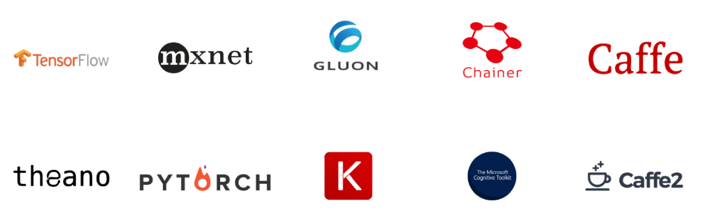
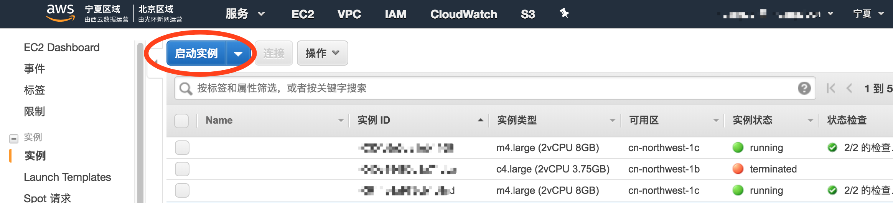
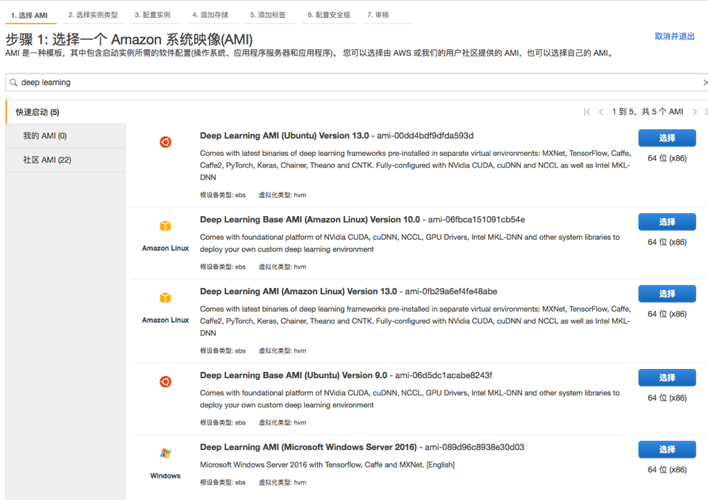
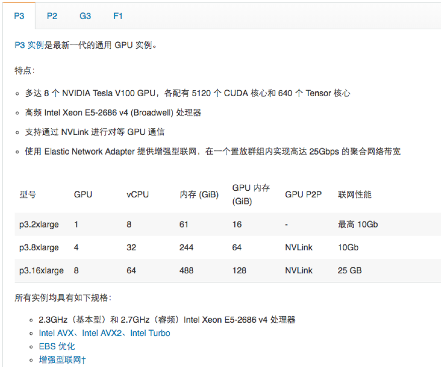
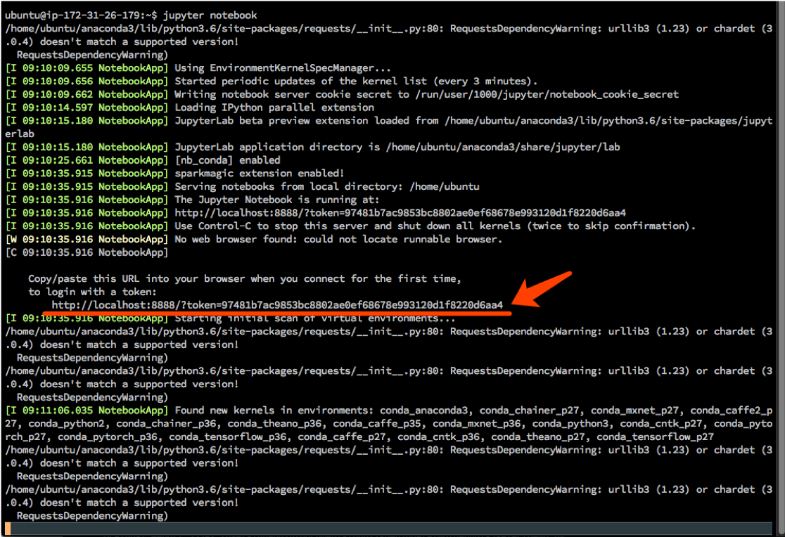
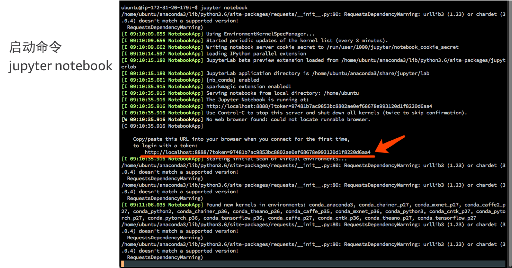
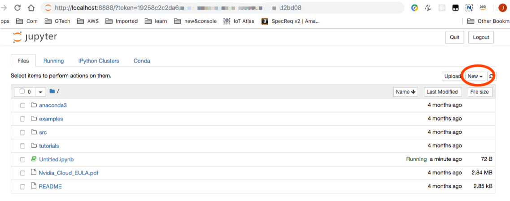

# 动手实验 5 - 启动深度学习 EC2 环境  

AWS Deep Learning AMI 可以为机器学习从业人员和研究人员提供基础设施和各种工具，从而加快在云中进行任意规模的深度学习的速度。您可以快速启动预先安装了常见深度学习框架 (如 Apache MXNet 和 Gluon、TensorFlow、Microsoft Cognitive Toolkit、Caffe、Caffe2、Theano、Torch、Pytorch、Chainer 和 Keras) 的 Amazon EC2 实例来训练复杂的自定义 AI 模型、实验新算法或学习新的技能和技巧。  

无论您需要 Amazon EC2 GPU 还是 CPU 实例，都无需为 Deep Learning AMI 支付额外费用，您只需为存储和运行应用程序所需的 AWS 资源付费即可。  
  

本实验会指导启动深度学习 EC2，并启动Jupyter Notebook 以供交换分析

## 步骤

1. 启动 EC2  
  

  
2. 选择深度学习镜像  

如果不知道如何选择，可以参考文档[《选择 Deep Learning AMI 》](https://docs.aws.amazon.com/zh_cn/dlami/latest/devguide/options.html)  

  

3. 选择实例类型  

如果需要 GPU 可以选择 GPU 实例，如果不需要 GPU，则可以考虑其他的 C 系列或 R 系列实例
  

4. 登录  
```
ssh -L localhost:8888:localhost:8888 -i <.pem file name> ubuntu@< instance DNS>
```
pem 文件是 EC2 实例的 Key ，instance DNS 是 EC2 的地址。  
这里使用 8888 端口转发，是为了后面的步骤访问 jupyter notebook  
  
登录后界面  
  

5. 启动 Jupyter notebook  
```
jupyter notebook
```
  
  

从回显中拷贝 jupyter notebook 的地址，在本地浏览器打开即可访问

6. 访问 Jupyter notebook

  

点击 NEW 生成对应的环境，然后你就可以开始做分析了。