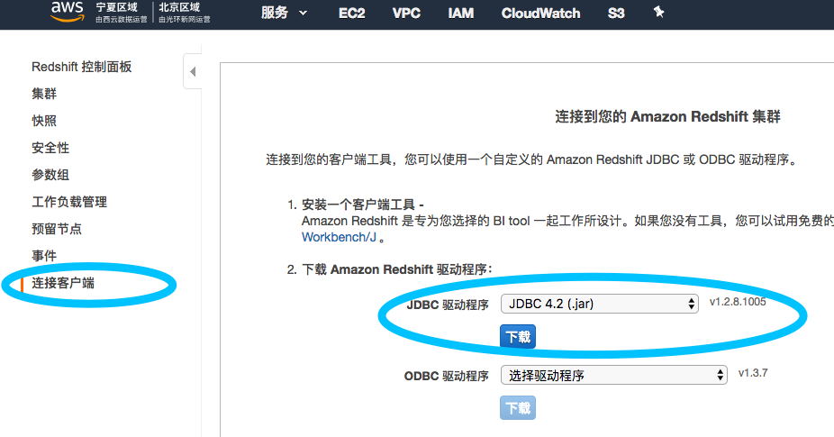

# BigData ImmersionDay

* Lab1 存储内的轻量级 ETL – Amazon S3 Select 

* Lab2 无服务器 ETL - AWS Lambda

* Lab3 Hadoop(Hive&Spark) - Amazon EMR

* Lab4 数据仓库 - Amazon Redshift 入门

* Lab5 启动深度学习 EC2 环境 Amazon Deep Learning AMI

## 前置准备

1. 本机安装 Python3 以运行实验中的 Python 示例

2. 本机安装 boto3，安装参考命令  

    pip3 install boto3 --user

3. 本地进行 AWS Credentials 配置

    aws configure

配置可以访问 AWS 的 access key，如果之前使用过命令行则重用CLI的配置即可。

4. 下载以下2个样例数据文件，并上传到你账户的 S3 某个 Bucket 中

    [pagecounts-20100212-050000.gz](./Lab1-S3Select/sample-data/pagecounts-20100212-050000.gz)

    [users-data.json](./Lab1-S3Select/sample-data/users-data.json)

5. 安装 数据仓库客户端  

安装以下其中一个客户端，或其他可以访问 PostgreSQL 的工具，例如：navicat
  
* 安装 SQL Workbench  (C/S)

https://docs.aws.amazon.com/zh_cn/redshift/latest/mgmt/connecting-using-workbench.html 

** 下载 JDBC 驱动程序

* 或安装 pgweb  (B/S)

https://docs.aws.amazon.com/zh_cn/redshift/latest/mgmt/connecting-from-psql.html

